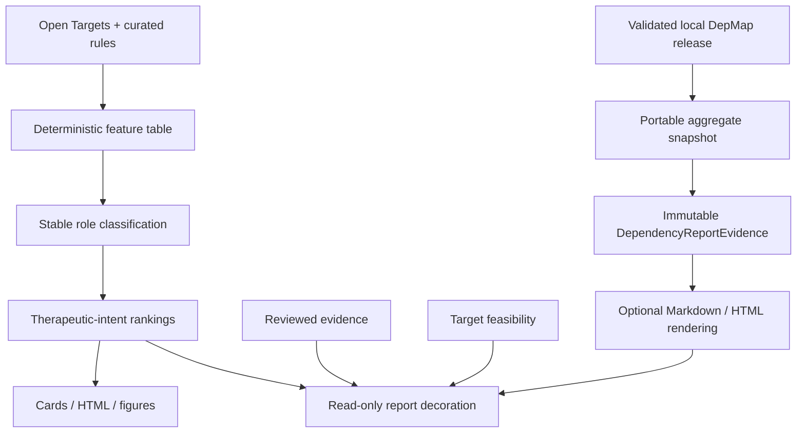

# TargetIntel-IO

**Transparent, deterministic therapeutic-intent target triage for anti-PD-1-resistant melanoma.**

TargetIntel-IO helps research teams distinguish possible therapeutic targets, biomarkers, resistance mechanisms, immune-context markers, tumor-intrinsic drivers, and poor direct targets while preserving the rules and evidence boundaries behind each result.

> Research-use software only. It generates hypotheses and portfolio-triage outputs, not medical advice, treatment recommendations, validated therapeutic targets, qualified biomarkers, causal proof, or clinical-response predictions.

## Project status

| Layer | Status | Purpose |
|---|---|---|
| Deterministic baseline | Available | Role classification and therapeutic-intent ranking |
| Common Evidence Layer | Complete | Typed source-linked evidence and read-only report decoration |
| Grounded evidence infrastructure | Complete | Audited extraction, review and grounded synthesis |
| Target feasibility | Complete | Offline modality-specific feasibility and coverage |
| Functional dependency | Research preview | DepMap/CRISPR evidence, closure, portable reporting and human review |

The project has progressed through v0.1.3 deterministic therapeutic-intent baseline, v0.2.0 Common Evidence Layer, v0.3.0 grounded evidence and human-review infrastructure, v0.4.0 target feasibility, and v0.5.0 DepMap/CRISPR functional-dependency architecture. A sanitized, portable DepMap Public 26Q1 aggregate bundle and versioned research-preview reports are published. The validated closure captures the authoritative antibody/IO baseline score and rank used by the bounded overlay; it does not contain the other two full productive score tables, so reports do not infer them. The former “real DepMap Public 26Q1 repository snapshot publication is pending Issue 512” status is superseded by this publication.

## Biological problem and framing

Anti-PD-1-resistant melanoma is biologically heterogeneous. A relevant gene is not automatically a direct drug target: it may instead support biomarker research, describe resistance context, mark an immune compartment, or be unsuitable for direct intervention. TargetIntel-IO therefore produces separate therapeutic-intent rankings rather than one undifferentiated “best target” list.

## Architecture



The deterministic baseline is authoritative. Optional layers decorate reports after ranking; they do not modify feature construction, scores, ranks, roles, target selection, or candidate activation.

## Deterministic baseline

The productive v0.1.3 baseline retrieves and annotates melanoma-associated targets, constructs a deterministic feature table, assigns a stable role, and ranks candidates for antibody/IO combination, resistance biomarker, and small-molecule intents. The original productive baseline remains 300 genes. Baseline scores and ranks remain unchanged by all optional reporting layers.

The internally curated 56-target benchmark measures implementation consistency and rule behavior. It is not an independent biological validation dataset and is not evidence of clinical performance.

## Optional evidence, feasibility, and functional dependency

The v0.2.0 Common Evidence Layer stores typed, source-linked observations separately from interpretation and provides read-only report decoration. v0.3.0 provides audited extraction, mandatory review, reviewed snapshots, and grounded synthesis infrastructure; v0.2.0 is infrastructure and report decoration, not clinical validation or a production LLM extractor. v0.4.0 feasibility reports modality-specific coverage, missingness, contradictions, tractability, clinical precedence, doability, and safety-data state without changing deterministic prioritization.

## v0.5.0 DepMap/CRISPR functional dependency

v0.5.0 is a research-preview architecture for optional, post-ranking functional-dependency reporting in melanoma anti-PD-1 resistance research. DepMap Public 26Q1 is the pinned functional-dependency release. The curated benchmark contains 56 targets, the discovery universe contains 331 unique identities, and the 18,531-gene DepMap universe is background only. That background is not a productive ranking: no new 18,531-gene productive ranking is generated.

Functional-dependency evidence can report gene-effect evidence, dependency-probability evidence, context-versus-reference comparisons, selectivity, and bounded integration-rank observations. It is deliberately distinct from clinical anti-PD-1 response evidence. DepMap cell-line dependency is not clinical anti-PD-1 response evidence, and absence of tumor-cell dependency does not invalidate an immune target.

Implemented components include deterministic local ingestion; immutable file and schema contracts; functional-dependency profiles; benchmark and coverage evaluation; a bounded integration overlay; release closure and reproducibility checks; portable aggregate snapshot export; immutable report evidence contracts; deterministic Markdown and HTML rendering; and regression and isolation gates. Production activation remains disabled, no approved authorization is emitted, and human review remains mandatory.

## Quick start

### Conda

```bash
git clone https://github.com/rsolerortuno/TargetIntel-IO.git
cd TargetIntel-IO
conda env create -f environment.yml
conda activate targetintel
```

### Pip

```bash
git clone https://github.com/rsolerortuno/TargetIntel-IO.git
cd TargetIntel-IO
python -m venv .venv
source .venv/bin/activate
python -m pip install --upgrade pip
python -m pip install -e ".[dev]"
```

## Main workflow

The normal deterministic workflow does not require a local DepMap release.

```bash
targetintel run
targetintel run --validate
targetintel run --refresh
targetintel run --depmap-snapshot data/releases/depmap/DepMap_Public_26Q1
targetintel run --help
python -m pytest -q
```

## Outputs

The productive workflow writes a deterministic feature table, therapeutic-intent ranked targets, Markdown cards, HTML reports and figures. Optional reviewed evidence, feasibility, and functional-dependency sections decorate matching reports only. A portable aggregate DepMap Public 26Q1 snapshot is a separate research-preview artifact and never changes scores, ranks, roles, or activation.

Versioned examples include [HTML reports](examples/html_reports/), [figures](examples/figures/), the [benchmark snapshot](examples/benchmark/README.md), and [sensitivity outputs](examples/sensitivity/README.md).

Single-cell and spatial evidence integration is planned for v0.6.0.

## Validation and reproducibility

TargetIntel-IO uses deterministic rule application and tie-breaking, versioned configuration and benchmark material, immutable evidence contracts, and offline regression tests. Run `targetintel run --validate` for the existing workflow validation and `python -m pytest -q` for the test suite. The 56-target benchmark remains an internal consistency check, not independent validation or clinical performance evidence.

<!-- issue-511-validation-boundaries -->
## Validation and benchmark boundaries

### Internal benchmark snapshot

The current 56-target benchmark is an internal implementation benchmark:

- Open Targets retrieval coverage is **25/56 (44.6%)**.
- The covered benchmark produced **100.0% stable-role accuracy**.
- Strict primary-intent accuracy is **91.1%**.
- Acceptable-intent accuracy is **100.0%**.

These results measure implementation consistency, not independent biological accuracy.
Complete TargetIntel evaluation coverage does not mean that Open Targets independently recovered every target.
The benchmark is internally curated rather than derived from an independent, blinded, prospective, or clinical validation dataset.

### Sensitivity snapshot

The current local sensitivity snapshot evaluates **42 scenarios** in which individual scoring weights are perturbed and renormalized.

Worst-case top-5 retention was: **antibody/IO 100%, biomarker 100%, small-molecule 80%**.

Worst-case top-10 retention was: **antibody/IO 90%, biomarker 100%, small-molecule 90%**.

Worst-case top-20 retention was: **antibody/IO 100%, biomarker 95%, small-molecule 100%**.

The minimum observed Spearman rank correlation was **0.8762**.

The maximum absolute primary-intent accuracy change was **5.36 percentage points**.

The maximum absolute acceptable-intent accuracy change was **3.57 percentage points**.

The maximum absolute cross-intent-specificity change was **5.66 percentage points**.

These observations describe local robustness around the configured deterministic rules. They do not establish that the rankings are independent of weight selection or biologically validated.
### External-validation boundary

No external patient-level responder/non-responder cohort is currently used to validate the target rankings.

Public associations, internal benchmark agreement, sensitivity analysis, feasibility annotations, reviewed evidence, and DepMap functional-dependency observations do not establish causality, clinical utility, therapeutic efficacy, or response prediction. All generated hypotheses require independent experimental, translational, and clinical validation.

### Grounded evidence and human review

The optional grounded-evidence workflow is documented in [`examples/llm/README.md`](examples/llm/README.md), with release boundaries in [`docs/releases/v0.3.0.md`](docs/releases/v0.3.0.md).

This layer requires mandatory human review and does not alter deterministic scores, rankings, or role classification.

## Scientific limitations

TargetIntel-IO does not make treatment recommendations, validate targets or biomarkers, establish causality, or predict patient response. Missing evidence is not negative evidence. DepMap cell-line profiles do not reproduce the complete tumor microenvironment, and broad dependency can reflect general essentiality. The real 26Q1 portable aggregate publication is available under `data/releases/depmap/DepMap_Public_26Q1`, with reports under `examples/html_reports/depmap_26q1` and `examples/target_cards/depmap_26q1`. Future research directions include single-cell/spatial integration, clinical-response research models, and knowledge-graph expansion.

## Repository map

```text
targetintel/                   Reusable package and CLI
targetintel/functional_dependency/  Optional portable reporting architecture
configs/                       Disease, resistance, benchmark and scoring rules
tests/                         Unit, integration, regression and isolation tests
examples/                      Versioned example outputs
docs/                          Specifications, roadmap and release evidence
data/ and results/             Local caches and generated outputs; normally uncommitted
```

## Roadmap

- v0.2.0 Common Evidence Layer
- v0.3.0 Grounded Literature Copilot and provider-agnostic LLM integration
- v0.4.0 Target feasibility and expanded Open Targets integration
- v0.5.0 DepMap/CRISPR functional dependency
- v0.6.0 Single-cell and spatial context
- v0.7.0 Clinical-response research model
- v0.8.0 De novo target discovery and knowledge graph
- v1.0.0 Multitumor target-intelligence platform

## Citation

```text
Soler Ortuño R. TargetIntel-IO: Explainable therapeutic-intent-aware target
intelligence for anti-PD-1-resistant melanoma.
```

## Author

Rafael Soler Ortuño, PhD

## License

Released under the [MIT License](LICENSE).
